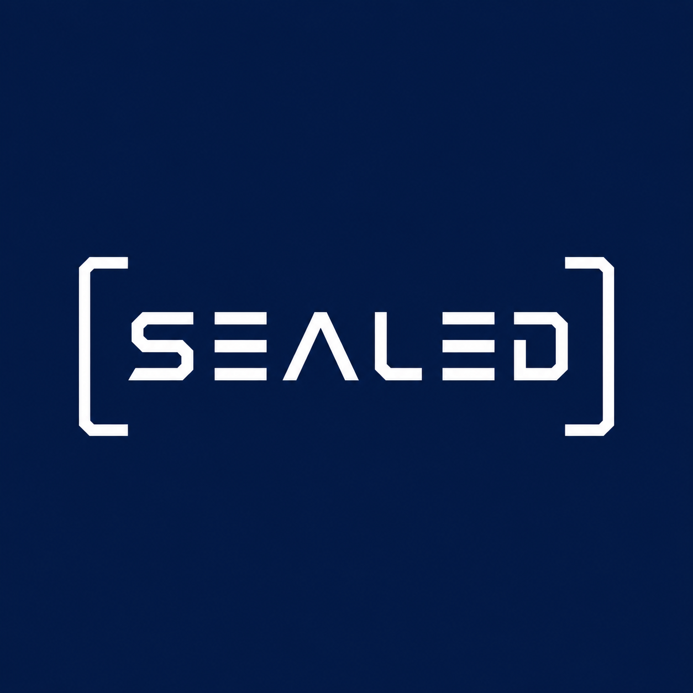

<p align="center">
  
  <br><br>
  <b>Tamper with the binary. The seal breaks.</b>
  <br><br>
  <a href="https://pypi.org/project/alia-sealed/"></a>
  <a href="https://github.com/TxsharDev/Sealed/blob/master/LICENSE"></a>
  <a href="https://github.com/TxsharDev/Sealed/actions"></a>
  <br><br>
  <a href="docs/wiki/Home.md">Wiki</a> &nbsp;|&nbsp;
  <a href="docs/wiki/Quick-Start.md">Quick Start</a> &nbsp;|&nbsp;
  <a href="docs/wiki/Use-Cases.md">Use Cases</a> &nbsp;|&nbsp;
  <a href="docs/wiki/Snippets.md">Snippets</a> &nbsp;|&nbsp;
  <a href="docs/wiki/CLI-Reference.md">CLI Reference</a> &nbsp;|&nbsp;
  <a href="docs/wiki/Security-Model.md">Security</a>
</p>

---

Every dependency you install is a trust decision you didn't make. Someone compiled that binary. You hope it matches the source. You have no proof.

Sealed fixes that. One command:

```bash
sealed install requests
```

What just happened:

1. Resolved every transitive dependency
2. Downloaded source from PyPI (not wheels, actual source)
3. Scanned source for dangerous patterns, CVEs, and install-time code execution
4. Measured the build environment (Python, compiler, OS, CPU, env vars)
5. Built each from source
6. Signed provenance chains with Ed25519
7. Checked trust policy (TOFU key pinning, revocation, multi-party)
8. Logged to append-only transparency chain
9. Installed verified artifacts

If anyone tampered with anything at any step, the seal doesn't verify. You know before the code runs.

## Install

```bash
pip install alia-sealed
```

No config. No setup. First run generates your signing key (encrypted, or stored in OS keychain).

## Usage

```bash
# Install with full supply chain attestation
sealed install requests

# Install specific version, skip dep sealing
sealed install flask --version 3.1.0 --no-deps

# Build and seal without installing
sealed build numpy

# Verify a seal
sealed verify ~/.sealed/store/requests-2.32.3/seal.json \
  --artifact ~/.sealed/store/requests-2.32.3/requests-2.32.3-py3-none-any.whl

# Inspect provenance chain
sealed inspect ~/.sealed/store/requests-2.32.3/chain.json

# List all sealed packages
sealed audit
```

### Security Analysis

```bash
# Behavioral sandbox: monitor what a package does at import
sealed sandbox suspicious-package

# Consensus build: build 3 times, check agreement
sealed consensus requests --num-builds 3

# Reproducibility check: build twice, compare
sealed reproduce flask

# Runtime integrity: check for post-install tampering
sealed watchdog check

# Trust graph: see your dependency tree with trust scores
sealed trust requests
```

### Team Sharing

```bash
# Export/import seals
sealed registry export -o team-seals.json
sealed registry import -i team-seals.json

# Export/import key pins
sealed registry export-pins -o pins.json
sealed registry import-pins -i pins.json

# Revoke a compromised key
sealed registry revoke --key <hex-public-key> --reason "compromised"
```

### Trust Policy

```bash
# Require 2+ independent signers
sealed policy set --min-signatures 2

# Require TPM attestation
sealed policy set --require-attestation tpm2

# Disable TOFU (manual key pinning only)
sealed policy set --tofu false
```

## What Makes This Different

| Tool | What It Does | Sealed's Angle |
|------|-------------|----------------|
| **Sigstore** | Keyless signing via OIDC, Rekor transparency log | Local-first. No external services. Works offline. |
| **in-toto** | Multi-party supply chain layout verification | Single command. No layout files. |
| **SLSA** | Framework for supply chain security levels | SLSA is a spec. Sealed is a tool. |
| **TUF** | Secure software update delivery | TUF secures distribution. Sealed secures the build. |
| **Nix/Guix** | Deterministic reproducible package managers | Sealed wraps your existing pip workflow. |

Zero-config, single-command, full-stack. Two commands to start:

```
pip install alia-sealed
sealed install <package>
```

## Architecture

```
sealed/
  chain.py           Provenance chain (SHA-256 hashing, environment fingerprinting)
  source.py          PyPI source fetcher (rejects wheels, verifies hashes)
  builder.py         Isolated builder with attestation and source audit
  attestation.py     Software attestation + TPM 2.0 (when available)
  audit_source.py    Source scanner (patterns, CVEs, setup.py analysis)
  seal.py            Ed25519 signing authority
  verify.py          End-to-end verifier
  resolver.py        Recursive dependency resolver (topological ordering)
  registry.py        SQLite seal store (TOFU key pinning, export/import)
  policy.py          Trust policy engine (multi-party, attestation, revocation)
  keystore.py        Encrypted key storage (PBKDF2 + NaCl SecretBox)
  reproduce.py       Reproducibility checker (build twice, compare)
  sandbox.py         Behavioral sandbox (monitor imports in isolation)
  consensus.py       Consensus builds (N builds, majority vote)
  watchdog.py        Runtime integrity watchdog (post-install hash check)
  trust_graph.py     Trust graph with scored weak-link analysis
  transparency.py    Append-only hash-chained transparency log
  ecosystem.py       Multi-ecosystem adapters (pip, npm, cargo)
  os_keychain.py     OS keychain (Windows DPAPI, macOS Keychain, Linux libsecret)
  lockfile.py        Lockfile for reproducible team installs
  cli.py             13 CLI commands
```

## Provenance Chain

Every sealed package carries a 5-step chain:

| Step | What It Records | What It Proves |
|------|----------------|----------------|
| `environment_attestation` | Python, compiler, OS, CPU, env vars, TPM PCRs | Build machine state is known |
| `source_audit` | Pattern scan + CVE check + setup.py analysis | Source was scanned for known dangers |
| `source_verify` | Archive hash vs PyPI registry hash | Source wasn't modified after download |
| `toolchain_capture` | Python interpreter hash | Exact compiler that built the artifact |
| `build` | Source dir hash in, artifact hash out | Binary came from this exact source |

Environment, all records, and package identity are hashed into the chain. Signed with Ed25519. One bit changed = signature fails = rejected.

## Security Model

**What Sealed catches:**

| Threat | How |
|--------|-----|
| Mirror tampering | SHA-256 fail-closed verification |
| Download MITM | Hash check catches modified bytes |
| Binary modification | Artifact hash in chain |
| Dangerous source | Pattern scanner + CVE check |
| Malicious imports | Behavioral sandbox |
| Malicious setup.py | Setup.py install-time execution scanner |
| Cross-package replay | Package name + version in chain hash |
| Key compromise | TOFU pinning alerts on key change |
| Key theft | Encrypted storage + OS keychain |
| Single signer risk | Multi-party N-of-M verification |
| Post-install tampering | Runtime watchdog |
| Non-reproducible build | Consensus builds |
| Dual signing | Transparency log equivocation detection |
| Pin poisoning | Deferred TOFU commit |

**Honest limitations:**

- Source audit catches known patterns, not logic bugs or novel techniques
- Behavioral sandbox is Python-level monkey-patching, not kernel isolation
- Consensus builds on one machine verify reproducibility, not independent agreement
- Transparency log is local-only (no gossip protocol)
- Build time scales with package complexity

## Roadmap

22 modules. 325 tests. 13 CLI commands. All shipped:

- [x] 5-step provenance chains with Ed25519 signatures
- [x] Environment attestation (software + TPM)
- [x] Source code safety scanning
- [x] Behavioral sandboxing at import time
- [x] Consensus builds (N-build majority vote)
- [x] Runtime integrity watchdog
- [x] Trust graph with weak-link analysis
- [x] Transparency log with equivocation detection
- [x] TOFU key pinning with deferred commit
- [x] Multi-party N-of-M verification
- [x] Encrypted key storage + OS keychain
- [x] Lockfile for team installs
- [x] Multi-ecosystem adapters (pip, npm, cargo)
- [x] Recursive transitive dependency sealing
- [x] SQLite registry with export/import
- [x] CI/CD GitHub Actions workflows

**Next:**
- Public transparency log with gossip protocol
- Kernel-level sandbox (seccomp/namespaces)
- Cross-machine consensus builds

## Documentation

- [Wiki: Quick Start](docs/wiki/Quick-Start.md)
- [Wiki: Use Cases](docs/wiki/Use-Cases.md) (10 real-world scenarios)
- [Wiki: Code Snippets](docs/wiki/Snippets.md) (12 copy-paste examples)
- [Wiki: Team Setup](docs/wiki/Team-Setup.md)
- [Wiki: CI/CD Integration](docs/wiki/CI-CD.md)
- [Wiki: CLI Reference](docs/wiki/CLI-Reference.md)
- [Wiki: Security Model](docs/wiki/Security-Model.md)
- [Wiki: Troubleshooting](docs/wiki/Troubleshooting.md)
- [Architecture](docs/ARCHITECTURE.md)
- [API Reference](docs/API.md)
- [Security](docs/SECURITY.md)

## License

Apache-2.0 | ALIA Labs

Built by [Tushar Sharma](https://github.com/TxsharDev) at ALIA Labs.
